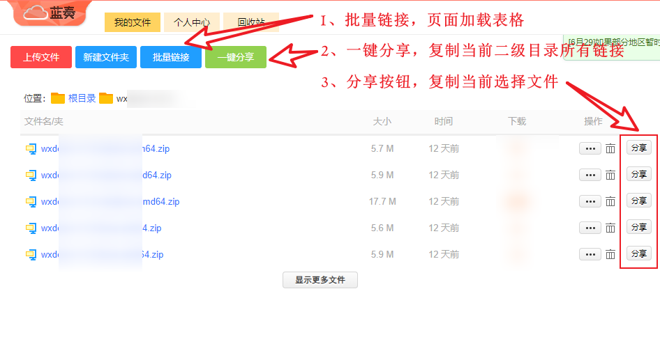
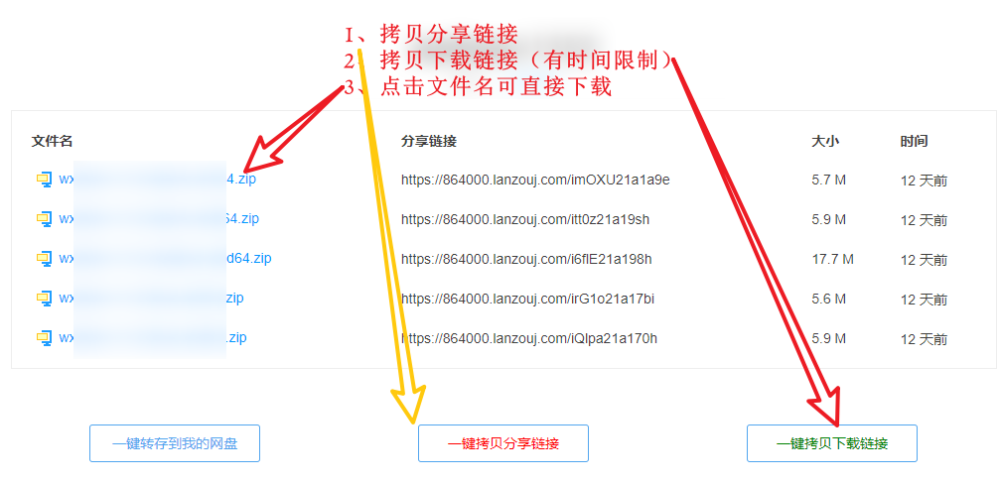

# 蓝奏云获取链接

蓝奏云获取外部分享链接。内部：批量获取文件夹，文件分享链接；外部：自动提交携带密码的访问链接，批量获取下载链接，分享链接；

## 内部

- 批量获取 `文件夹` 分享链接（携带密码）
- 批量获取 `文件` 分享链接
- 分享按钮
  - 当前选中的文件分享链接

- 一键分享（不支持根目录）
  - 复制当前目录下所有文件分享链接

## 外部

- 自动提交携带密码的访问链接
  - 例如：https://xxxx.lanzouj.com/b0hc2ekvc密码:1234
- 批量获取 `文件下载`地址
- 批量获取 `文件` 分享链接
- 点击文件名直接下载

## 安装
1. 安装 [Tampermonkey](https://www.tampermonkey.net/) 浏览器扩展，[国内](https://www.crxsoso.com/webstore/detail/dhdgffkkebhmkfjojejmpbldmpobfkfo)安装，黑色的猴子。
2. 点击 [脚本链接](https://greasyfork.org/zh-CN/scripts/498225) 或手动复制脚本代码。
3. 在 `Tampermonkey` 中创建一个新脚本，将代码粘贴到编辑器中并保存。

## 使用

### 内部

### 外部

